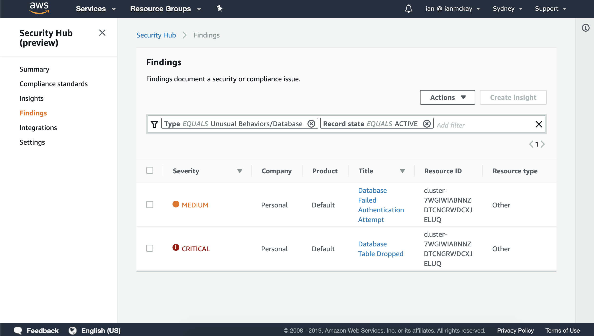

# Aurora Activity Streams to Security Hub

> Analyse database activity with Aurora Database Activity Streams and send findings to Security Hub

## Installation and Usage

**Note**: At the time of writing, only Aurora Postgres 2.3 (compatibility version 10.7) and above supports activity streams.

Click the above link to deploy the stack which is required to deploy the stack. You should have the target Aurora cluster already running.

If you prefer, you can also manually upsert the [template.yaml](template.yaml) stack from source and [compile](COMPILING.md) your own copy of the Lambda source. Please note that if you do this, you'll need to vendor the AWS Encryption SDK within a compatible environment due to static linking issues.

## How It Works

The stack will use a custom resource to add a database activity stream to your pre-existing Aurora cluster. This activity stream will stream events via a Kinesis Data Stream which has a Lambda subscriber. The Lambda will decrypt the events and perform some simple classification actions based on the events.

If the classification of events detects something notable, it will generate a finding in Security Hub. If you entered an e-mail address on creation, it will also send a notification to your e-mail via SNS.

### Modifying to your needs

This pattern is designed to be modified to fit your needs. The rules around content classification are deliberately non-complex such that you can adapt to your own needs. The SNS could also be replaced with a more structured downstream event notification system.

## Lambda Performance

I did some testing on the performance of the Lambda processing the events from the stream. The activity stream fires at least once every 2 seconds due to a heartbeat event and in my testing I achieved:

* 730 millis average @ 128MB RAM
* 340 millis average @ 256MB RAM

This is likely due to the overhead required to perform the decryption operations.
