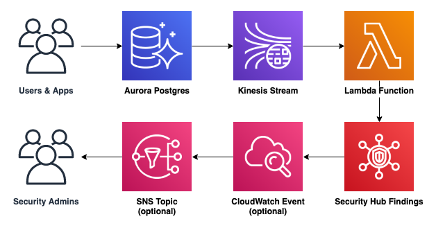

# Aurora Activity Streams to Security Hub [work-in-progress]

> Analyse database activity with Aurora Database Activity Streams and send findings to Security Hub

## Installation and Usage

TBC

## How It Works

TBC

## Lambda Performance

The activity stream fires at least once every 2 seconds due to a heartbeat event. In my testing I achieved:

* 730 millis average @ 128MB RAM
* 340 millis average @ 256MB RAM

This is likely due to the overhead required to perform the decryption operations.